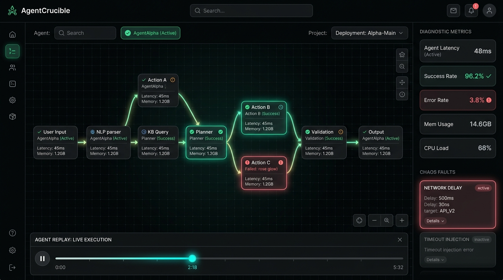

# 🔥 AgentCrucible

**The Autonomous Agent Chaos Testing, Time-Travel Debugging & Evaluation Studio**

[](https://opensource.org/licenses/Apache-2.0)
[](#testing--verification)
[](#testing--verification)
[](#zero-trust-sandbox-architecture)
[](#benchmark-matrix)
[](#technical-architecture)

---



---

## 1. Executive Summary & Why AgentCrucible Is Needed

Modern autonomous AI agents and tool-calling LLM workflows are entering production across DevOps, finance, software engineering, and customer operations. However, testing and debugging these systems remains notoriously difficult due to fundamental reliability challenges:

* **Non-Deterministic Execution**: When an agent fails at step 8 of a 12-step trajectory, developers cannot simply place a breakpoint; re-running the workflow triggers different thoughts, divergent tool calls, and high token costs.
* **Opaque Tool Deadlocks**: Agents frequently fall into unhandled retry storms, cyclic parameter loops, or hallucinatory function invocations when downstream APIs experience transient errors.
* **Cascading Schema Drift**: When microservices return subtle schema changes or error responses, agents often hallucinate fake responses rather than recovering gracefully.
* **Adversarial Exploitation**: Hostile prompt injections hidden inside external data feeds, APIs, or repository files can hijack agent instructions and exfiltrate secrets.

**AgentCrucible** resolves these failure modes by providing an interactive, developer-grade **observability, chaos-testing, and counterfactual simulation studio**. It transforms opaque agent traces into interactive Directed Acyclic Graphs (DAGs), injects synthetic real-world failures, enables time-travel counterfactual branching, and scores agent resilience with automated benchmark matrices.

---

## 2. Core Studio Capabilities

```
                          ┌────────────────────────┐
                          │     AgentCrucible      │
                          │   Interactive Studio   │
                          └───────────┬────────────┘
                                      │
         ┌──────────────┬─────────────┼──────────────┬──────────────┐
         │              │             │              │              │
         ▼              ▼             ▼              ▼              ▼
   ┌───────────┐  ┌───────────┐ ┌───────────┐  ┌───────────┐  ┌───────────┐
   │Trajectory │  │Time-Travel│ │Chaos Lab  │  │Adversarial│  │Multi-Agent│
   │ DAG View  │  │ & Branch  │ │  Deck     │  │  Fuzzer   │  │Memory View│
   └─────┬─────┘  └─────┬─────┘ └─────┬─────┘  └─────┬─────┘  └─────┬─────┘
         │              │             │              │              │
         └──────────────┼─────────────┼──────────────┼──────────────┘
                        │             │              │
                        ▼             ▼              ▼
            ┌──────────────────────────────────────────────────┐
            │               Engine Core Layer                  │
            │  - TraceEngine (Hierarchical DAG & Telemetry)    │
            │  - ChaosEngine (Fault Injectors & Jitter)        │
            │  - BranchingEngine (Counterfactual Forks & Diff) │
            │  - FuzzerEngine (Evolutionary Red-Teaming)       │
            │  - TraceIngestionEngine (OTLP & LangChain Ingest)│
            │  - DiagnosticEngine (Loop & Taint Detectors)     │
            │  - EvalEngine (Grading Matrix & CI Reports)      │
            │  - SimulationRunner (Live Synthetic Execution)   │
            └──────────────────────────────────────────────────┘
```

### 1. Interactive Trajectory DAG Canvas (`/dag`)
* **Hierarchical Topology**: Renders chains of thought, tool executions, sub-agent spawns, and memory mutations with smooth SVG Bezier curve connections.
* **Node Anatomy**: Displays model identifiers, execution latency, exact token usage, status badges, and expandable chain-of-thought scratchpads.
* **Canvas Controls**: Smooth pan/zoom, viewport reset, and a real-time minimap overlay.

### 2. Time-Travel & Counterfactual Replay Studio (`/replay`)
* **Scrubbable Execution Timeline**: Step forwards and backwards through execution history with millisecond-accurate latency spike visualization.
* **Counterfactual "What-If" Branching**: Fork execution from any step, mutate tool responses, edit instructions, or adjust hyperparameters to observe divergence.
* **Side-by-Side Split Diff**: Compare baseline runs against counterfactual branches with token savings deltas, duration comparisons, and outcome verification.

### 3. Chaos Engineering Lab (`/chaos`)
* **Deterministic & Stochastic Perturbations**:
  * `RATE_LIMIT_429`: Transient throttling with `Retry-After` header parsing.
  * `LATENCY_SPIKE`: P99 latency spikes (+4,500ms) to test timeouts.
  * `SQL_INJECTION_TAINT`: Data plane taint detection and WAF guardrail triggers.
  * `SCHEMA_CORRUPTION`: Mutilated payloads and truncated JSON.
  * `INDIRECT_PROMPT_INJECTION`: Hostile instructions embedded in documentation.
  * `TIMEOUT`: Upstream connection drops and gateway timeouts (504).
* **Live Telemetry Stream**: Real-time event log tracking fault injection and agent self-healing.

### 4. Evolutionary Adversarial Red-Teaming Fuzzer (`/fuzzer`)
* **Genetic Mutation Engine**: Evolves adversarial prompts across generations using *Delimiter Evasion*, *Role Reversal*, *Instruction Smuggling*, *Leetspeak Obfuscation*, *Unicode Homoglyphs*, and *Base64 Wrappers*.
* **Vulnerability Index Scoring**: Evaluates guardrail defense rates across prompt injection, data exfiltration, privilege escalation, and tool abuse.

### 5. Multi-Agent Shared Memory Graph (`/memory`)
* **Blackboard State Topology**: Visualizes shared memory partitions across collaborating agent swarms (e.g., Supervisor, Analyst, and Compliance agents).
* **State Mutation Timeline**: Tracks step-by-step key-value changes and variable progression across the entire swarm.

### 6. OpenTelemetry & LangChain Trace Ingestion (`/ingest`)
* **Format Normalization**: Ingests standard OpenTelemetry (OTLP) span arrays, LangChain / LangGraph run JSON exports, and custom agent traces.
* **Instant Conversion**: Normalizes external spans into AgentCrucible DAG nodes with calculated durations and token accounting.

### 7. Automated Diagnostics & Benchmark Matrix (`/diagnostics` & `/benchmarks`)
* **Automated Heuristic Scanners**: Scans trajectories for cyclic deadlocks, uncompacted context dumps, critical-path latency bottlenecks, and hallucinated function calls with 1-click auto-remediations.
* **Resilience Scoring**: Computes objective scores across Goal Accuracy, Chaos Resilience, Token Efficiency, Cost Discipline, and Security Guardrails with 1-click export to CI/CD Markdown and JUnit XML.

---

## 3. Zero-Trust Sandbox Architecture (Docker / Container Isolation)

To protect host environments when evaluating untrusted pull requests from external contributors, AgentCrucible enforces a **Zero-Trust Isolation Policy**:

```
[ Contributor PR / Untrusted Code ]
               │
               ▼
┌────────────────────────────────────────────────────────┐
│             Hardened Docker Sandbox Container          │
│               (Dockerfile.sandbox)                     │
├────────────────────────────────────────────────────────┤
│  • Non-Root User: sandbox:sandbox (UID 10001)          │
│  • Linux Capabilities: ALL DROPPED                     │
│  • Resource Ceilings: CPU: 2.0 Cores | RAM: 2048 MB    │
│  • Security Flags: no-new-privileges: true             │
│  • Temporary tmpfs: noexec, nosuid                     │
├────────────────────────────────────────────────────────┤
│  Sequence:                                             │
│  1. TypeScript Compilation (tsc --noEmit)              │
│  2. Engine Unit Test Suite (npm test)                  │
│  3. Headless Resilience Evals (npm run cli:eval)       │
│  4. Production Bundle Build (npm run build)            │
└──────────────────────────┬─────────────────────────────┘
                           │
       ┌───────────────────┴───────────────────┐
       ▼                                       ▼
 [ PASS: Safe to Review / Merge ]     [ FAIL: Automatic Rejection ]
```

* **Automated Sandbox Verification Command**:
  ```powershell
  # Windows PowerShell
  .\scripts\sandbox-verify-pr.ps1 -PR <number>

  # Linux / macOS Bash
  ./scripts\sandbox-verify-pr.sh <number>
  ```

---

## 4. Getting Started & How to Use

### Prerequisites
* **Node.js**: v20+ or v22+ LTS
* **npm**: v10+
* **Docker**: v24+ (required for isolated PR sandbox verification)

### One-Command Quickstart

Clone and boot the complete development studio:
```bash
git clone https://github.com/Compile-Craft-IN/AgentCrucible.git
cd AgentCrucible
npm install
```

Windows PowerShell:
```powershell
# Runs tests, checks benchmarks, compiles bundle, and starts dev studio:
.\run.ps1
```

Linux / macOS:
```bash
./run.sh
```

Open **`http://localhost:5173`** in your browser.

---

### Command Reference

| Command | Action | Description |
| :--- | :--- | :--- |
| `npm run dev` | Start Dev Studio | Boots the reactive Vite development server on port 5173 |
| `npm test` | Run Unit Tests | Runs the Vitest test suite for all engine modules |
| `npm run cli:eval` | Headless CI Eval | Evaluates resilience invariants directly in the terminal |
| `npm run scheduler:once` | Audit Cycle | Executes a single periodic resilience and fuzzing audit |
| `npm run scheduler` | Continuous Daemon | Runs continuous background resilience monitoring |
| `npm run github:listen` | GitHub Listener | Polls repository for open PRs and issues to triage |
| `npm run build` | Production Build | Strict TypeScript typecheck and optimized Vite bundling |

---

## 5. Keyboard Navigation Reference

| Key | Scope | Function |
| :---: | :--- | :--- |
| **`Space`** | Replay / Timeline | Play / Pause trajectory execution replay |
| **`←` / `→`** | Timeline Scrubber | Step 1 node backward / forward in time |
| **`B`** | Selected Node | Fork counterfactual branch from this step |
| **`C`** | Selected Node | Inject Chaos perturbation onto this step |
| **`D`** | Replay Studio | Toggle Side-by-Side Split Diff View |
| **`1`** | Global | Switch to Trajectory DAG Canvas |
| **`2`** | Global | Switch to Time-Travel & Replay Studio |
| **`3`** | Global | Switch to Chaos Engineering Lab |
| **`4`** | Global | Switch to Adversarial Red-Team Fuzzer |
| **`5`** | Global | Switch to Multi-Agent Memory Graph |
| **`6`** | Global | Switch to Diagnostics & Health Report |
| **`7`** | Global | Switch to Resilience Benchmark Matrix |
| **`?`** | Global | Open Keyboard Shortcuts Cheat Sheet |
| **`Esc`** | Modal / Drawer | Deselect node or close active modal overlay |

---

## 6. Preloaded Production Scenarios

1. **DevOps Autonomous Incident Mitigator (`scenario-devops-001`)**:
   * SRE agent triages a 5xx spike on a payment service, queries Prometheus, inspects Kubernetes pod logs, encounters an HTTP 429 rate limit fault, recovers via exponential backoff, isolates PostgreSQL connection exhaustion, and triggers a canary rollback.
2. **FinTech Fraud & Regulatory Audit Swarm (`scenario-fintech-002`)**:
   * Supervisor agent coordinates Fraud Analyst and Compliance Officer subagents handling a \$4.2M wire burst. An unescaped memo triggers a SQL injection chaos fault, solved by counterfactual parameterized prepared statements and OFAC sanctions enforcement.
3. **Full-Stack Code Refactoring Agent (`scenario-refactor-003`)**:
   * Agent refactors synchronous handlers to SQLAlchemy 2.0 AsyncEngine. Recovers from dependency hallucinations by installing verified driver `asyncpg` and neutralizes an indirect prompt injection attack embedded in `README.md`.

---

## 7. Testing & Verification

AgentCrucible enforces 100% automated test coverage across all engine and evaluation modules:

```
 RUN  v4.1.11 D:/OpenSource/TestingAbility

 ✓ tests/engine.test.ts (7 tests)
   ✓ TraceEngine computes valid hierarchical DAG coordinates and stats
   ✓ ChaosEngine generates proper faults and perturbations
   ✓ BranchingEngine forks trajectories and computes diff comparisons
   ✓ DiagnosticEngine detects loops, security risks, and latency bottlenecks
   ✓ EvalEngine scores resilience and outputs valid reports
   ✓ FuzzerEngine evolves adversarial payloads and computes vulnerability index
   ✓ TraceIngestionEngine ingests OTLP and LangChain traces
 ✓ tests/eval.test.ts (3 tests)
   ✓ evaluates benchmark invariants for: DevOps Autonomous Incident Mitigator
   ✓ evaluates benchmark invariants for: FinTech Fraud & Regulatory Audit Swarm
   ✓ evaluates benchmark invariants for: Full-Stack Code Refactoring Agent

 Test Files  2 passed (2)
      Tests  10 passed (10)
```

---

## 8. Contributing & Governance

* **Governance**: The repository is autonomously maintained under [RULES.md](./RULES.md) and [AGENTS.md](./AGENTS.md).
* **Zero-Trust**: Pull requests are evaluated inside non-root Docker sandboxes (`Dockerfile.sandbox`). Refer to [CONTRIBUTING.md](./CONTRIBUTING.md).
* **Security**: For vulnerability disclosures, refer to [SECURITY.md](./SECURITY.md).
* **Code of Conduct**: Community standards are defined in [CODE_OF_CONDUCT.md](./CODE_OF_CONDUCT.md).

---

## 9. License

This project is licensed under the **Apache License, Version 2.0**. See the [LICENSE](./LICENSE) file for details.
